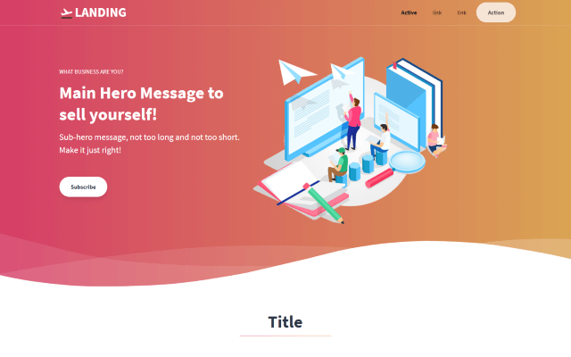

# [Componentized Landing Page Template](https://www.tailwindtoolbox.com/templates/landing-page)

[Componentized Landing Page](https://6598255785.gluuie.com) is fork of an MIT Licensed open source, generic landing page template of [Tailwind CSS](https://tailwindcss.com/) created by [Tailwind Toolbox](https://www.tailwindtoolbox.com/).

## Getting Started

### Use the Demo AppSite : https://gluuie.com
* Create a new AppDomain in the Demo AppSite
* Sync the Git Repository if it is not available
* Copy the Git Folder to the Root AppSite Folder

### Deploy using the Docker Image:
* [Download and run the latest docker image](https://hub.docker.com/r/arshucs/appweb)
* Navigate to the Exposed Localhost Url https://localhost:8080
* Sync the Git Repository if it is not available
* Copy the Git Folder to the Root AppSite Folder

### Deploy using the published AppWeb Viewer:
* [Download and run AppWeb Viewer from Github Repository](https://github.com/Arshu/AssembleWebApps.git)

## Copyright and MIT License

Copyright 2022  Arshu Consultanct Pvt Ltd. Code released under the MIT license.

## Original Copyright and License

Copyright 2018-2020 Astrava.Solutions Ltd. Code released under the MIT license.
